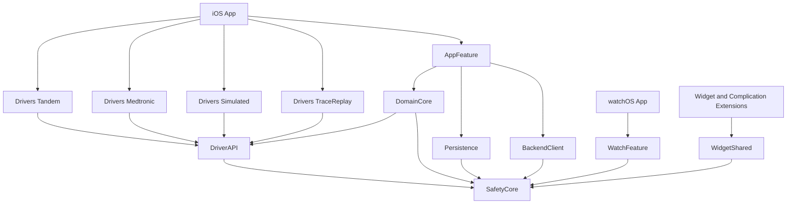

# Architecture Spine — GlycemicGPT iOS + watchOS

## Design Paradigm

**Hexagonal (ports and adapters), with an actor at the device edge.**

The domain — glucose, insulin, freshness, thresholds, the Coverage Claim — sits at the centre and depends on nothing. Everything touching the outside world is an adapter behind a port.

| Hexagon role | Here |
| --- | --- |
| Domain core | `SafetyCore`, `DomainCore` |
| Driving ports | Capability protocols in `DriverAPI` |
| Driven adapters | `Drivers/*`, `Persistence`, `BackendClient` |
| Presentation adapters | `AppFeature`, `WatchFeature`, widget targets |

The pattern is not imposed — it is already the product's shape. A pump Driver *is* an adapter and the closed Capability set *is* a port list. Naming it buys the dependency rule, a core testable without hardware, and the substitutability that makes the Simulated and Trace-Replay Drivers first-class rather than scaffolding.

## Invariants & Rules



### AD-1 — Hexagonal paradigm with an actor-guarded device edge

- **Binds:** all
- **Prevents:** a Driver reaching into persistence, networking or UI; domain logic that cannot be exercised without hardware.
- **Rule:** every outside-world interaction crosses a port declared in `DriverAPI` or an adapter module. Domain code names no platform framework.

### AD-2 — Module topology, with `SafetyCore` linked by every rendering target

- **Binds:** all
- **Prevents:** phone, Watch and widget disagreeing about the same stored value (SI-4).
- **Rule:** `SafetyCore` has zero dependencies and is linked by **every** target that renders, validates or decays a glucose value — iOS app, watchOS app, widget extension, complication extension, and every Driver. A second definition of a Safety Constant anywhere is a build failure.
- **`SafetyCore` also owns every shape two units must agree on**: the widget snapshot record, the phone-to-Watch envelope, the Coverage Claim vocabulary, and the Freshness Tier. Without this, no two units that must agree on a shape share any module — and AD-3 forbids the edge that would otherwise fix it. A contract type defined anywhere else is a defect.

### AD-3 — One-way dependency direction, CI-enforced

- **Binds:** all
- **Prevents:** cyclic graphs; a Driver acquiring its own storage or network path.
- **Rule:** a Driver may depend **only** on `DriverAPI` and `SafetyCore`. Nothing depends on an app target. The graph above is asserted by a CI check over the resolved package manifest.

### AD-4 — Swift 6 strict concurrency; the device edge is an actor

- **Binds:** `Drivers/*`, `DomainCore`, `Persistence`
- **Prevents:** a background Bluetooth wake racing the UI over shared mutable state.
- **Rule:** Swift 6 language mode (which implies complete strict concurrency), warnings as errors. Each Driver owns an actor; Core Bluetooth delegate callbacks land on a dedicated queue and hop into it. Types crossing a module boundary are `Sendable` value types.

### AD-5 — `Glucose` is a value type that cannot hold an invalid number

- **Binds:** SI-2, SI-3, every FR carrying a glucose value
- **Prevents:** a clamped or coerced reading entering the system; a crash loop from a trapping initializer during a background wake.
- **Rule:** the initializer validates against the **absolute** bound only. Narrowable Safety Limits are applied at the Driver ingest gate and are **never** a parameter to `Glucose.init` — parameterising it would make a Backend narrowing retroactively erase stored rows on read-back, selectively toward lows, remotely. Storage is canonical mg/dL. The initializer **throws** outside `20...500` — never `precondition`, never a clamp, never a silent substitution. mmol/L exists only as a formatting output, converted once by the single Conversion Factor, rounded last.

### AD-6 — GRDB unforked, at-rest protection from iOS Data Protection

- **Binds:** `Persistence`, SI-10
- **Prevents:** a second maintained fork; an unreadable store during a locked-device background write.
- **Rule:** GRDB **unforked**, on plain SQLite. At-rest protection comes from **iOS Data Protection at `CompleteUntilFirstUserAuthentication`** — never `NSFileProtectionComplete`, which fails background writes while the device is locked. SQLCipher is **not** used: the PRD requires platform data protection, and SQLCipher over SPM requires editing GRDB's own manifest (v7.11.1 ships commented-out lines, not package traits), which would cost a second fork and a passphrase to manage for protection iOS already provides hardware-backed. Migrations are numbered, forward-only, and start at v1 with no Android inheritance.

### AD-7 — One decoder, explicit tolerant reading

- **Binds:** `BackendClient`, SI-12
- **Prevents:** a newer Backend silently breaking an older client; a renamed field silently becoming `nil`.
- **Rule:** exactly one `JSONDecoder` configuration exists. Every Backend DTO implements `init(from:)` explicitly — unknown fields ignored, a **missing consumed field throws**. No Backend-supplied value is a strict enum; unrecognised members decode to an explicit unknown case. Synthesized `Codable` is prohibited on Backend DTOs, because its default behaviour is the inverse of this rule.

### AD-8 — EC-JPAKE runs on a pinned fork of `swift-crypto`

- **Binds:** `Drivers/Tandem`
- **Prevents:** a hand-written P-256 implementation guarding pump pairing.
- **Rule:** depend on a project fork of `apple/swift-crypto`, pinned to an exact upstream tag, adding one product that exports the existing `CryptoBoringWrapper` target (`EllipticCurvePoint`, `ArbitraryPrecisionInteger`, `FiniteFieldArithmeticContext`). The maintained delta is a product declaration and an access-level change — **no cryptographic code is authored or vendored.** **The conformance vectors do not exist yet and must be generated first.** `JpakeAuthenticatorTest.kt` carries seven tests and *zero* known-answer vectors — state-machine assertions, two failure paths, and a randomized round-trip against a simulated server seeded from live `SecureRandom`. So generating known-answer vectors from the Kotlin implementation under fixed seeds, and committing them as fixtures, is a **prerequisite task**, not an assumption. The Swift implementation then asserts byte-for-byte reproduction of those fixtures, and that test is the canary for an upstream rebase.

### AD-9 — One App Group, exactly one database writer

- **Binds:** `Persistence`, widget and complication extensions
- **Prevents:** two processes writing one SQLite file; an extension holding a lock a background wake needs.
- **Rule:** one App Group container, its identifier templated on the Builder's Team ID. **The app is the only writer.** Extensions read a small versioned snapshot file written by the app — never the database.
- The snapshot is **one record written atomically** (write-temp-then-rename), carrying its schema version and the instant it was produced. A reader that cannot parse it, or that finds a version it does not know, renders *unknown* — never a partial record. A non-atomic write racing a timeline read would otherwise yield a structurally valid, semantically mixed record: a stale value rendered Fresh, which is SI-6's worst failure.

### AD-10 — The Coverage Claim has one implementation and one owner

- **Binds:** SI-6, FR-83, FR-84, FR-126
- **Prevents:** the wrist claiming coverage the phone cannot deliver; two selectors drifting apart.
- **Rule:** the selector lives in `SafetyCore` and is pure. The **phone computes**; the Watch **renders and decays** the phone's claim and never derives one. The envelope carries an explicit schema version **and the Not-Watching Reason vocabulary is versioned with it** — versioning the envelope alone lets a wrist that knows five reasons receive one of eight at a matching version and render it as a generic "nothing is watching", which sends the user to replace a working sensor. A reason the Watch does not recognise renders as its literal identifier plus the generic text, never as a different reason.

### AD-11 — Core Bluetooth restoration is the only load-bearing relaunch path

- **Binds:** `Drivers/*`, `DomainCore`, SI-6
- **Prevents:** a coverage claim resting on background execution iOS does not guarantee.
- **Rule:** `CBCentralManager` and `CBPeripheralManager` are configured with restoration identifiers, and restoration is the only relaunch mechanism any coverage claim may rest on. `BGTaskScheduler` and background `URLSession` are best-effort and may never extend a claim.
- **Restoration availability is itself a runtime input to the claim (see AD-21).** Apple TN3115: from **iOS 26**, only apps that set up Bluetooth accessories through **AccessorySetupKit** are relaunched after a force-quit or a Control Center Bluetooth toggle. The deployment floor is iOS 17.0, so this product spans that behaviour change and the claim is OS-version-dependent.

### AD-12 — No therapeutic write exists to call

- **Binds:** SI-1, `DriverAPI`, `Drivers/*`
- **Prevents:** a write surface appearing behind a flag, a subclass, or a future Capability.
- **Rule:** no protocol in `DriverAPI` declares a write, command or set member. CI scans Driver targets for delivery verbs and pump-write characteristic identifiers and fails on a match. The Capability set is closed at six; adding to it is a PRD change.

### AD-13 — Typed errors; no silent defaults on a safety path

- **Binds:** all
- **Prevents:** a failure becoming a plausible-looking value.
- **Rule:** every fallible boundary returns a typed error. No safety-relevant path substitutes a default, a clamp or a zero. A rejected reading, threshold or Safety Limit leaves last-known-good in force and surfaces the bound that failed.
- **The Driver failure taxonomy is declared once in `DriverAPI`**, not per Driver. Module-local error enums are permitted only where no other unit consumes them; a failure any other unit branches on is a shared case. Two Drivers with incomparable taxonomies force every consumer to special-case each Driver.
- **Recovery has a named owner at every boundary.** A typed error with no designated recoverer is a defect: `DomainCore` owns recovery for Driver and Persistence failures, `AppFeature` owns user-facing recovery, and no unit silently absorbs an error it did not originate.

### AD-14 — One injectable clock

- **Binds:** `SafetyCore`, `DomainCore`
- **Prevents:** freshness, decay, chart windows and day-boundary alignment disagreeing about *now*.
- **Rule:** a single `Clock` protocol supplies every current time. A direct `Date()` in `SafetyCore` or `DomainCore` fails lint.

### AD-15 — Cleartext is decided in code, not delegated to ATS

- **Binds:** `BackendClient`, NFR-20, FR-150
- **Prevents:** a plist posture that is assumed rather than proven, and a broadening nobody notices.
- **Rule:** the in-app policy is authoritative — no plaintext request leaves the device for any host that is not a literal loopback, private, carrier-NAT or link-local address or a `.local` name, classified by **literal address parsing only, never DNS**, identically in every configuration. `[ASSUMPTION]` The Info.plist configuration achieving this must be **verified on a device** before being bound; nothing may state a posture as fact until that baseline is recorded, after which the Entitlements and Plist Guard prevents broadening it.


### AD-16 — One Driver lifecycle, owned by the platform

- **Binds:** `DriverAPI`, `Drivers/*`, PRD contract C-1
- **Prevents:** five `DriverAPI` implementers — Tandem, Medtronic, Simulated, Trace-Replay and the app-hosted Nightscout source — inventing five lifecycles.
- **Rule:** a Driver is a state machine whose states are declared once in `DriverAPI`. **The platform owns every transition; a Driver never self-transitions.** Every entry point is re-entrant-safe, because Core Bluetooth restoration can re-enter after termination. Teardown is idempotent. A Driver that needs a state the protocol does not declare is a `DriverAPI` change, not a local addition.

### AD-17 — Build configuration is a closed dimension, and composition is subtractive only

- **Binds:** all targets, SI-1
- **Prevents:** a configuration that quietly carries a capability another does not — the loophole every "identically in every configuration" rule assumes away.
- **Rule:** the configurations are exactly **Debug, Development and Release**. Composition is **subtractive only**: a configuration may remove a Driver or a diagnostic surface, never add a capability. Fault injection is a dedicated flag, off in every configuration the pipeline produces. No pipeline-produced build carries a telemetry credential. The compile-time Driver kill switch operates by exclusion, and CI additionally builds an all-Drivers-enabled configuration so excluded code stays compiled and tested.

### AD-18 — The Watch app is an independently-built unit, not a renderer

- **Binds:** `WatchFeature`, PRD contract C-3, SI-4, SI-6
- **Prevents:** a wrist that goes blank or silent whenever the phone is unreachable; a filesystem join across containers that cannot exist.
- **Rule:** the Watch app owns **its own locked-readable cache and its own App Group container**, and joins nothing to the phone's container by path. It schedules its own local alerts and its own re-alarm ladder. It still never **derives** a Coverage Claim — AD-10 holds; it renders and decays the phone's. The phone-to-Watch transfer is **one versioned envelope** carrying the latest reading, insulin on board, thresholds, display preferences and the claim — not the claim alone — and an envelope whose version the Watch does not recognise degrades to *not watching* with a reason.

### AD-19 — History cursors are durable and monotonic-by-decode

- **Binds:** `Drivers/*`, `Persistence`, SI-8
- **Prevents:** silently lost insulin records after an iOS termination.
- **Rule:** every Driver persists its history cursor **before** acknowledging a batch, and **never advances it past a record that failed to decode**. A process-local cursor is prohibited: iOS terminates the app routinely, and a cursor held only in memory loses exactly the records the user cannot see are missing.

### AD-20 — Every safety invariant names its enforcing mechanism

- **Binds:** SI-1 … SI-12
- **Prevents:** an invariant that is bound in a header and enforced nowhere.
- **Rule:** each invariant maps to a mechanism below; an invariant with no mechanism is a defect, not an aspiration.

| Invariant | Enforced by |
| --- | --- |
| SI-1 no therapeutic write | AD-12 (no such member exists; CI symbol scan) |
| SI-2 reject never clamp | AD-5 (throwing initializer) |
| SI-3 mg/dL canonical | AD-5 (storage type) |
| SI-4 one Safety Constant definition | AD-2 (`SafetyCore` linked by every target) |
| SI-5 Alert Floor never fires stale or unconfirmed | AD-10 (one pure selector in `SafetyCore`) + AD-14 (one clock) |
| SI-6 Coverage Claim never overstates | AD-10, AD-11, AD-18 |
| SI-7 completed deliveries only | AD-16 (Driver decode contract) + AD-13 |
| SI-8 cursors never skip an undecoded record | AD-19 |
| SI-9 no health value in logs | Conventions (logging) + CI scan |
| SI-10 Keychain and at-rest protection | AD-6 |
| SI-11 Safety Limits narrow only | AD-13 (typed rejection at the validation boundary, last-known-good retained) |
| SI-12 tolerant reader, loud on missing | AD-7 |


### AD-21 — AccessorySetupKit where available, and the claim knows which relaunch rules apply

- **Binds:** `Drivers/*`, `SafetyCore`, SI-6
- **Prevents:** a Coverage Claim that assumes a relaunch the running OS will not perform.
- **Rule:** adopt **AccessorySetupKit** for Pump setup wherever the OS provides it. The Coverage Claim takes the effective relaunch rules as an input: on an OS where a force-quit or Bluetooth toggle means the app is never relaunched, the claim resolves to *not watching* with a reason the user can act on — opening the app — rather than silently assuming recovery. `[ASSUMPTION]` The exact AccessorySetupKit adoption surface and its interaction with the existing pairing flows needs a device-verified spike; the PRD does not mention it because this behaviour change post-dates its research.

### AD-22 — Decode failure and domain rejection are different outcomes

- **Binds:** `Drivers/*`, SI-2, SI-7, SI-8
- **Prevents:** one Driver silently losing insulin records while another wedges history permanently behind a healthy-looking UI.
- **Rule:** a record whose **bytes could not be parsed** is a *decode failure*: the record is not consumed and the cursor does **not** advance (AD-19). A record that parsed cleanly but carries an **out-of-range value** is a *domain rejection*: the record **is** consumed, the cursor **does** advance, the value is dropped and logged with the bound it violated. Conflating them is a defect in either direction — treating an out-of-range value as a decode failure wedges history behind a value that will never become valid, and it is remotely triggerable by a Backend narrowing.

### AD-23 — Acknowledgement is owned by the phone; the Watch sends intent, never state

- **Binds:** `DomainCore`, `WatchFeature`, FR-74
- **Prevents:** the wrist re-alarming for thirty minutes after the user acknowledged on the phone, or the reverse.
- **Rule:** alert acknowledgement state has exactly one owner — `DomainCore` on the phone. The Watch sends an **acknowledgement intent** and renders the phone's resulting state; it never holds authoritative acknowledgement state of its own. The intent is idempotent and survives a delivery retry. An offline acknowledgement is honoured locally for rendering and reconciled on reconnect, and is never reversed by a later delivery of the same alert.

## Consistency Conventions

| Concern | Convention |
| --- | --- |
| Naming | Modules `PascalCase`; Driver targets `Drivers/<Vendor>`; a port is a capability noun (`GlucoseSource`), never `…Manager` or `…Service`. |
| Domain types | Value types with throwing initializers. Units in the type name where ambiguous, never a bare `Int`. |
| Ids | Driver ids are reverse-domain and double as settings-suite and Keychain service names. |
| Dates | `Date` internally; ISO-8601 with fractional seconds on the wire; a pump epoch is converted at the Driver boundary and never leaks inward. |
| Errors | One typed error enum per module boundary. No `NSError`, no stringly-typed failures. |
| Logging | Structured, one category per module. No health value, raw payload or credential at any level (SI-9). |
| Config | Build settings for what ships; Keychain for secrets; App Group `UserDefaults` only for non-safety preferences. |
| Tests | Domain and Driver tests run on Linux via `swift test` without Xcode; UI tests are Simulator-only and non-required. |

## Stack

| Name | Version |
| --- | --- |
| Swift | 6.x (language mode 6, strict concurrency complete) |
| iOS / watchOS floor | 17.0 / 10.0 |
| GRDB.swift | 7.11.1 |
| swift-crypto (project fork) | 4.5.1, pinned to an exact tag |
| SwiftUI, WidgetKit, Core Bluetooth | platform |
| fastlane + match | Builder-side signing |

## Structural Seed

```text
ios-unofficial/
  Package.swift            # SPM workspace; AD-3's graph is asserted from here
  Sources/
    SafetyCore/            # constants, Glucose, Freshness, Coverage Claim selector, Clock. Zero deps.
    DriverAPI/             # Capability ports, device models, SafetyLimits
    Drivers/
      Tandem/              # EC-JPAKE + protocol; depends on the swift-crypto fork
      Medtronic/           # clean-room SAKE reimpl (Android wraps org.openminimed:javasake, GPL-3.0); Beta
      Simulated/           # shipped; net-new, no Android counterpart
      TraceReplay/         # shipped; net-new; recorded frames through the real parsers
    DomainCore/            # orchestration, repositories, Alert Floor
    Persistence/           # GRDB + SQLCipher; sole writer
    BackendClient/         # Contract Pin, tolerant decoding
    AppFeature/            # iPhone screens
    WatchFeature/          # Watch screens
    WidgetShared/          # snapshot reader for both extensions
  Apps/                    # thin app + extension targets, no logic
  Tests/
  contract/                # vendored openapi.json + CONTRACT_VERSION
```

## Capability → Architecture Map

| PRD area | Lives in | Governed by |
| --- | --- | --- |
| 5.1 Pump connection and pairing | `Drivers/*`, `AppFeature` | AD-1, AD-4, AD-11 |
| 5.2 Drivers and the Catalog | `DriverAPI`, `Drivers/*` | AD-2, AD-3, AD-12 |
| 5.3 Monitoring and dashboard | `AppFeature`, `SafetyCore` | AD-5, AD-14 |
| 5.4 Alerting and coverage | `DomainCore`, `SafetyCore` | AD-10, AD-11, AD-13 |
| 5.5 Insulin and meals | `DomainCore`, `BackendClient` | AD-7, AD-13 |
| 5.6 AI Chat | `BackendClient`, `AppFeature` | AD-7 |
| 5.7 Watch and glanceable | `WatchFeature`, `WidgetShared` | AD-2, AD-9, AD-10 |
| 5.8 Data, sync, Backend | `Persistence`, `BackendClient` | AD-6, AD-7, AD-9, AD-15 |
| 5.9 Onboarding and settings | `AppFeature` | AD-13 |
| 5.10–5.12 Build, gates, docs | repository tooling | AD-3, AD-12 |

## Deferred

| Deferred | Why it can wait |
| --- | --- |
| Per-screen view and state shape | Owned by the code once UI exists; two units cannot diverge incompatibly over it. |
| Full database schema | AD-6 fixes the mechanism and the migration rule; the columns are the code's. |
| Backend wire schema | Owned by the vendored Contract Pin, not by this spine. |
| Per-Driver *wire* protocol detail (frames, opcodes, CRC) | Belongs to each Driver's epic. The lifecycle every Driver shares is **not** deferred — see AD-16. |
| Medtronic transport viability | Gated on the spike the PRD sequences first; a negative result changes `Drivers/Medtronic` only. |
| CI runner topology and job splits | Repository tooling; the required-check roster is fixed by the PRD. |
| Observability and crash reporting | No project telemetry exists to design; a Builder's own DSN is their choice. |
| Swift 6.2 default actor isolation | A language-mode option with no cross-unit divergence at this altitude; settled once when the toolchain is pinned. |
